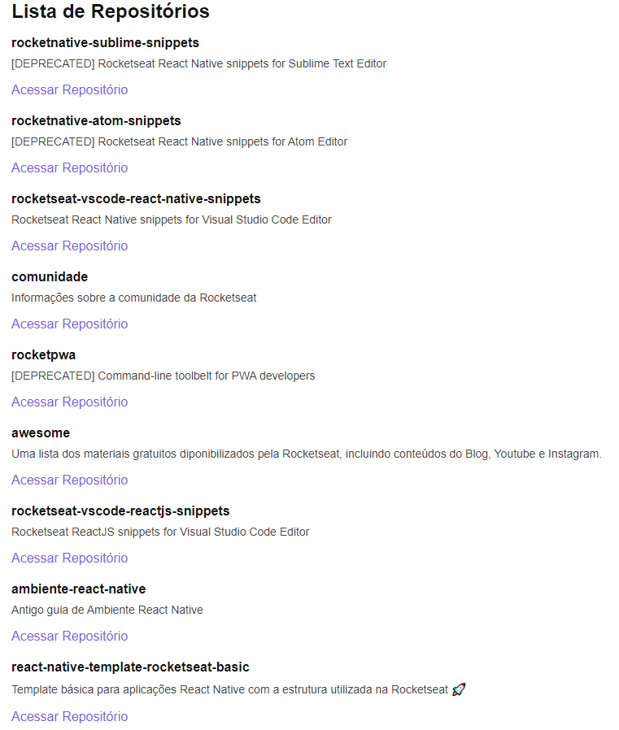

# Github Explorer 📸



&nbsp;
## Ignite React - 01
Listagem de repositórios GitHub

&nbsp;
## ⚙️ Build
Para compilar a aplicação utilize a sequência: 
```
yarn
yarn dev
```

&nbsp;
## 🛠️ Built With

- [React](https://reactjs.org/)


&nbsp;
## Authors

* **Rocketseat** - [Rocketseat](https://github.com/Rocketseat)
* **Lucas Dib** - [LucasDibz](https://github.com/LucasDibz)