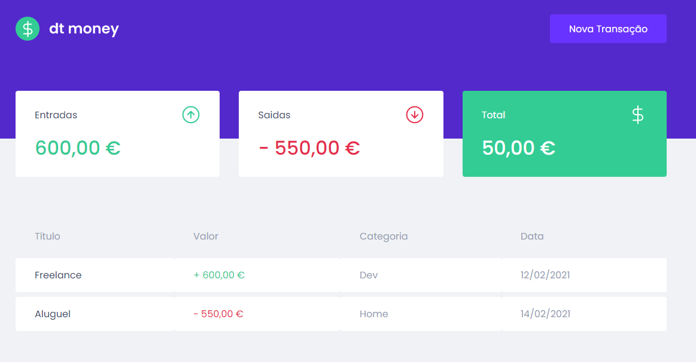

# dtMoney 📸



&nbsp;
## Ignite React - 02
App de transações financeiras

&nbsp;
## ⚙️ Build
Para compilar a aplicação utilize a sequência: 
```
yarn
yarn dev
```

&nbsp;
## 🛠️ Built With

- [React](https://reactjs.org/)
- [Next.js](https://nextjs.org/)
- [Mirage.js](https://miragejs.com/)


&nbsp;
## Authors

* **Rocketseat** - [Rocketseat](https://github.com/Rocketseat)
* **Lucas Dib** - [LucasDibz](https://github.com/LucasDibz)