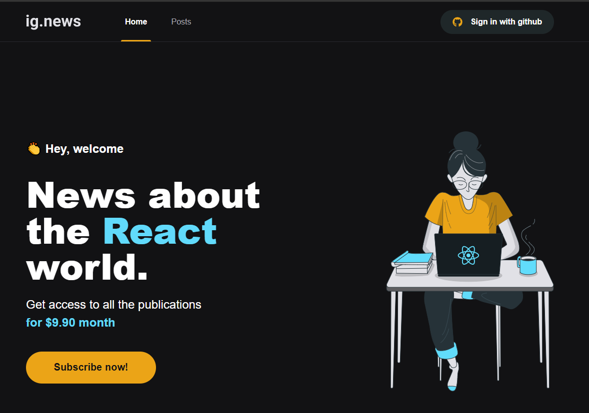

# ignews 📸



&nbsp;
## Ignite React - 03
Blog com sistema de subscription.

&nbsp;
## ⚙️ Build
Para compilar a aplicação utilize a sequência: 
```
yarn
yarn dev
```

Para testar a aplicação utilize:
```
yarn test
```

&nbsp;
## 🛠️ Built With

- [React](https://reactjs.org/)
- [Next.js](https://nextjs.org/)
- [FaunaDB](https://fauna.com/)
- [Prismic](https://prismic.io/)
- [Stripe](https://stripe.com/)


&nbsp;
## Authors

* **Rocketseat** - [Rocketseat](https://github.com/Rocketseat)
* **Lucas Dib** - [LucasDibz](https://github.com/LucasDibz)