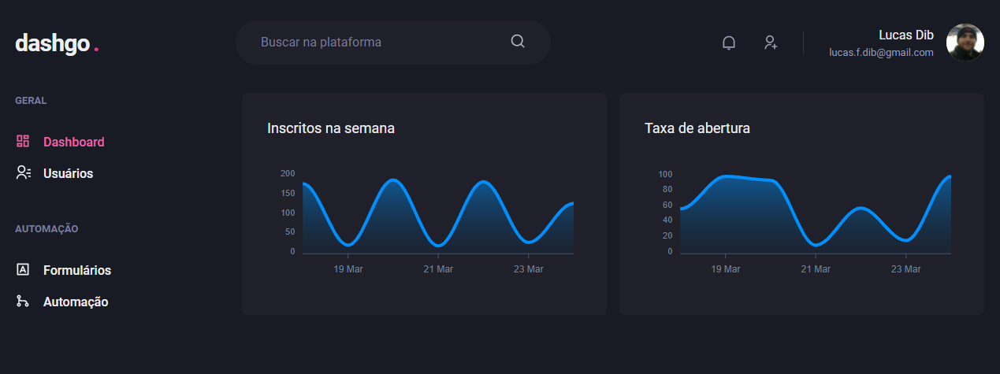

# dashgo 📸



&nbsp;
## Ignite React - 04
Dashboard de sistemas

&nbsp;
## ⚙️ Build
Para compilar a aplicação utilize a sequência: 
```
yarn
yarn dev
```

&nbsp;
## 🛠️ Built With

- [React](https://reactjs.org/)
- [Next.js](https://nextjs.org/)
- [Chakra UI](https://chakra-ui.com/)
- [Mirage.js](https://miragejs.com/)
- [Faker.js](https://github.com/marak/Faker.js/)
- [React Query](https://react-query.tanstack.com/)


&nbsp;
## Authors

* **Rocketseat** - [Rocketseat](https://github.com/Rocketseat)
* **Lucas Dib** - [LucasDibz](https://github.com/LucasDibz)