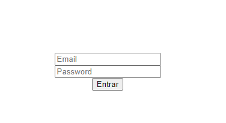

# NextAuth 📸



&nbsp;
## Desafio Ignite React - 05
Sistema de login com permissões de usuários, jwt, cookies.

&nbsp;
## ⚙️ Test
Para compilar a aplicação utilize a sequência: 
```
yarn
yarn dev
```
start the auth backend `ignite-reactjs-auth-backend` on this repo

admin user:
`admin@rocketseat.team`/`123456` 

limited user:
`estagiario@rocketseat.team`/`123456`

&nbsp;
## 🛠️ Built With

- [React](https://reactjs.org/)
- [Next.js](https://nextjs.org/)


&nbsp;
## Authors

* **Rocketseat** - [Rocketseat](https://github.com/Rocketseat)
* **Lucas Dib** - [LucasDibz](https://github.com/LucasDibz)