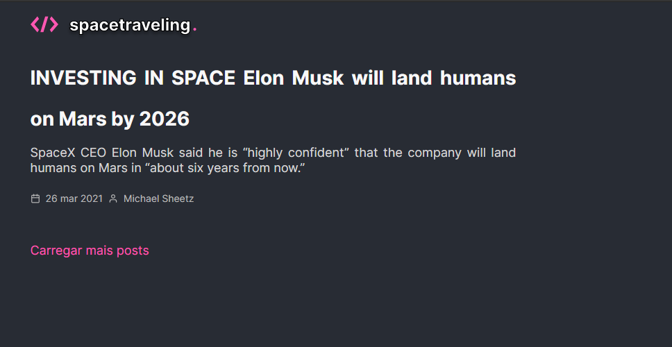

# Spacetraveling 📸



&nbsp;
## Desafio Ignite React - 04
Criar do zero uma aplicação de um blog com Prismic CMS a partir de um layout do Figma

&nbsp;
## ⚙️ Test
Para compilar a aplicação utilize a sequência: 
```
yarn
yarn dev
```

Para testar a aplicação utilize:
```
yarn test
```

&nbsp;
## 🛠️ Built With

- [React](https://reactjs.org/)
- [Next.js](https://nextjs.org/)
- [Prismic](https://prismic.io/)


&nbsp;
## Authors

* **Rocketseat** - [Rocketseat](https://github.com/Rocketseat)
* **Lucas Dib** - [LucasDibz](https://github.com/LucasDibz)