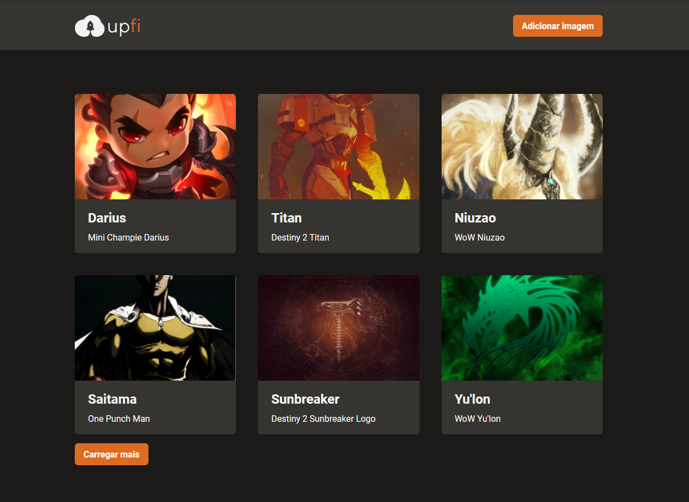

# Upfi 📸



&nbsp;
## Desafio Ignite React - 06
Realizar o upload e listagem de imagens utilizando React Query, React Hook Form e Chakra UI.

&nbsp;
## ⚙️ Test
Para compilar a aplicação utilize a sequência: 
```
yarn
yarn dev
```

Para testar a aplicação utilize:
```
yarn test
```

&nbsp;
## 🛠️ Built With

- [React](https://reactjs.org/)
- [Next.js](https://nextjs.org/)
- [Chakra UI](https://chakra-ui.com/)
- [React Query](https://react-query.tanstack.com/)
- [React Hook Form](https://react-hook-form.com/)
- [FaunaDB](https://fauna.com/)
- [ImgBB](https://imgbb.com/)


&nbsp;
## Authors

* **Rocketseat** - [Rocketseat](https://github.com/Rocketseat)
* **Lucas Dib** - [LucasDibz](https://github.com/LucasDibz)